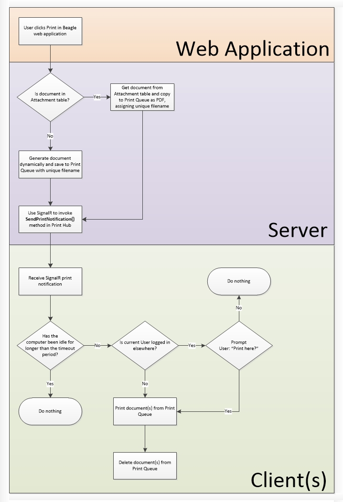

#Printing from Beagle
**This documentation should be replaced with a pointer to the equivalent documentation in Beagle Core once the functionality has been added to Core.**

##Overview
Printing from Beagle was a major challenge due to the requirement for documents to be printed 'silently' - i.e. without using the web browser's print functionality. Often Users need to be able to print multiple documents with a single click, and in cases such as prescribing drugs, we require documents to be printed automatically when another action is performed.

The solution arrived at for meeting these requirements was to create a small, client-side application which needs to be installed on every computer where printing from Beagle is required. This application is called the Beagle Desktop Client, and the code for it is in the same repository as the Beagle web application itself. This application is able to monitor a SignalR hub, to which the web application sends notifications of print requests, and derive from these the documents that need printing.

##The Printing Process Using the Beagle Desktop Client
The basic process of printing from Beagle is:
1. Print is requested in Beagle.
2. Document is retried from *Attachment* table or generated dynamically.
3. Document is copied to the Print Queue folder, as specified in the *SystemConfiguration* table.
4. Print Notification is sent to Beagle's SignalR hub.
5. Beagle Desktop Client detects Print Notification (based on User who generated it - see Beagle Desktop Client documentation for more details) and parses out the filename of the document to print.
6. Beagle Desktop Client prints document and deletes from the Print Queue folder.

The process is also described in this diagram.

